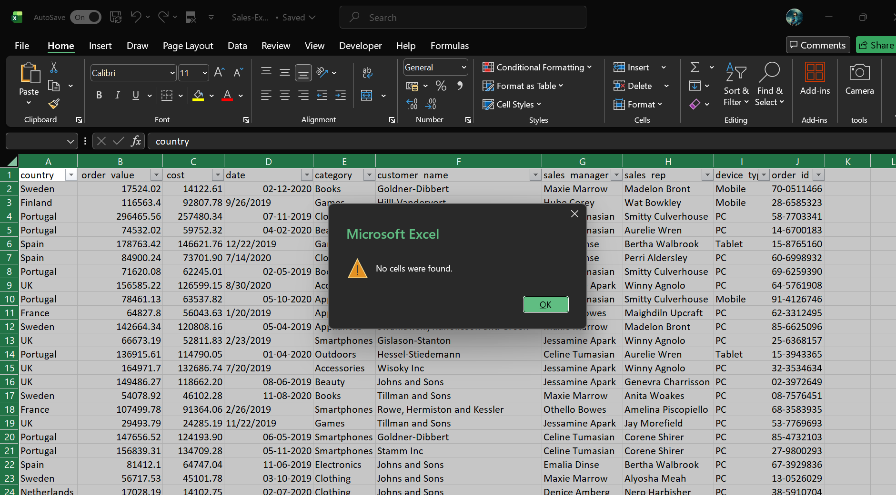

# Sales Data Cleaning & Preprocessing (Excel)

## 📌 Objective
Clean and preprocess a sales dataset to make it ready for analysis using Microsoft Excel tools.

## 🛠 Tools Used
- Microsoft Excel

## 📋 Cleaning & Validation Steps

1. **Missing Values Check**
   - Used Go To Special → Blanks
   - No missing values found

2. **Duplicates Check**
   - Used Data → Remove Duplicates
   - No duplicate records were found

3. **Date Column Standardization**
   - Original dates had mixed formats (dd-mm-yyyy, mm/dd/yyyy)
   - Converted to a uniform `dd-mm-yyyy` format so Excel recognizes them as dates

4. **Numeric Validation**
   - Verified that `order_value` and `cost` are stored as numeric values
   - Ensured formatting supports calculations

5. **Text Standardization**
   - Reviewed categorical fields like Country, Category, Device Type
   - Ensured consistent formatting (no extra spaces, uniform capitalization)

## 📌 Result
The dataset is now clean, consistent, and ready for analysis or visualization.

## 🖼 Visual Proof 

.png)
.png)

## 👤 Author
**Aryansh Dhuria**

